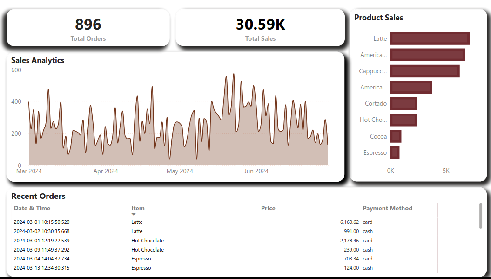

# Project Overview

## Project Name: COFFEE SALES DASHBOARD USING POWER BI

[]

### Description

The Coffew Sales Dashboard is a data visualization project developed using Power BI to analyze and present sales data, customer behavior. The project aims to provide actionable insights and facilitate decision-making processes based on the data insights derived from the dashboard.

### Objectives

1. **Data Exploration:** Explore and analyze trends, patterns, and correlations within the dataset.
   
2. **Performance Monitoring:** Monitor key performance indicators (KPIs) such as sales analysis

3. **Decision Support:** Provide stakeholders with intuitive visualizations and reports to support strategic decision-making processes.

### Features

- **Total Sales Overview:** Provides a comprehensive view of total sales figures over a specified period.
  
- **Sales Trends:** Visualizes sales trends using a line chart to identify patterns and seasonality.
  
- **Product Performance:** Analyzes product performance through bar charts, highlighting top-performing products and categories.
  
- **Recent Orders:** Displays a tabular view of the most recent orders, including order details such as order ID, date, product, and amount.

